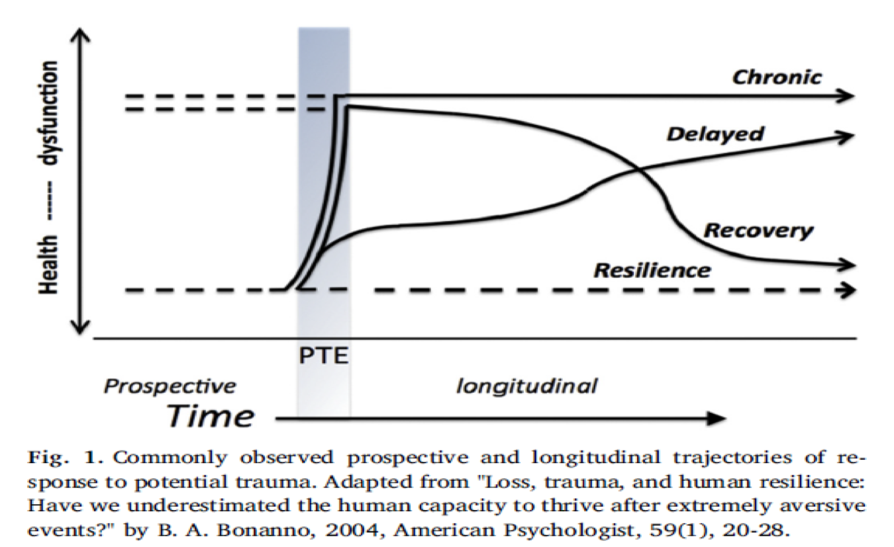

```{r setup, include=FALSE}
knitr::opts_chunk$set(echo = FALSE)
```

## PTSD Trajectories

\tiny
{#id .class width=80% height=90%}

@bonanno2004loss

## Thesis Plan Diagram Part 1

\tiny
{#id .class width=80% height=70%}  

## Variables of Interest Diagram 

\tiny
{#id .class width=80% height=70%}

## Machine Learning Techniques 

\tiny
\begin{table}
\caption{Machine Learning Techniques}
\begin{tabular}{p{45mm}p{35mm}p{20mm}}
Technique & Outcome Type & R Package \\
\hline \hline
Support Vector Machines (SVMs) & Classification & e1071 \\ 
Support Vector Regression (SVR) & Regression & e1071 \\
Multivariate Regression & Regression & stats \\
Logistic Regression & Classification & stats \\
K-nearest neighbour (KNN) & Classification & class \\
Decision Tree & Classification and Regression & tree \\
Random Forests & Classification and Regression & randomForest, ranger \\
XGBoosted Trees & Classification and Regression & xgboost \\
Neural Networks & Classification and Regression & neuralnet
\end{tabular}
\end{table}


## Thesis Plan Diagram Part 2

\tiny
{#id .class width=80% height=70%}

## Outcome Measures

\tiny
\begin{table}
\caption{Outcome Measures}
\begin{tabular}{p{20mm}p{13mm}p{15mm}p{18mm}p{18mm}}
Outcome Measure & Outcome Type & Measure & Advantage & Disadvantage \\
\hline \hline
Outcome Class Only & Multinomial & CxC & Easily understood and comparable & No understanding of margin or likelihood of correctness \\
Outcome Class as a product of Probability & Numeric (Probability) & CxC, PxP & Easily understood, clinical application & PxP is hard to compare effectively \\
Outcome Probability only & Numeric (Probability) & PxP & Methodological Advantageous & Hard to compare, limited clinical application \\
Outcome Probability, final distribution comparison & Totaled Numeric Calculation (Probability/Total Distribution) & PxP & Methodological Advantageous, Positive to understand global trends & limited clinical application, limited individual level accuracy calculation (only global)
\end{tabular}
\end{table}

## References {.allowframebreaks}
\tiny